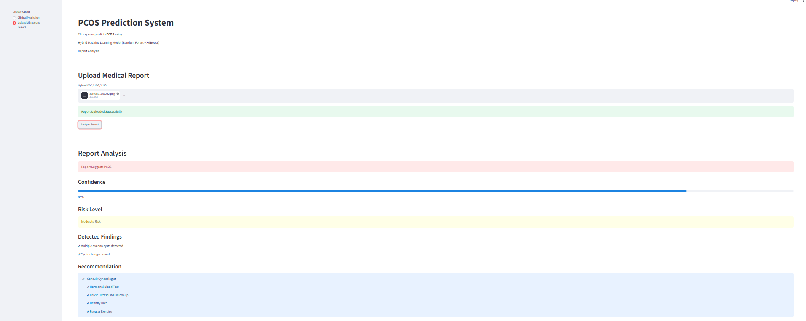
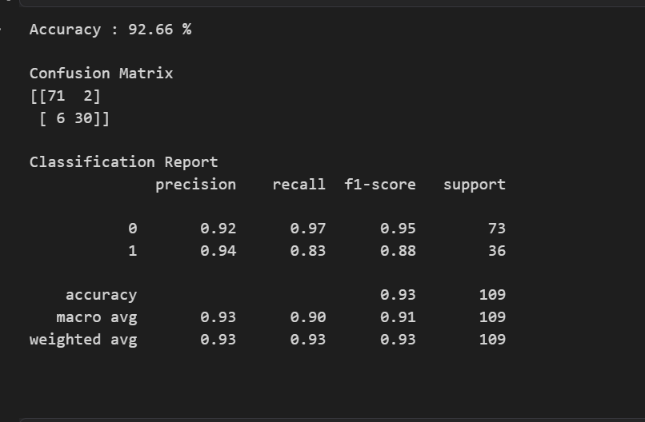

#  Hybrid Machine Learning-Based PCOS Prediction System

> An  healthcare application for the early prediction of Polycystic Ovary Syndrome (PCOS) using a Hybrid Machine Learning Model (Random Forest + XGBoost) with an interactive Streamlit web application.

---

##  Project Overview

Polycystic Ovary Syndrome (PCOS) is one of the most common hormonal disorders affecting women of reproductive age. Early detection plays a crucial role in reducing long-term health complications.

This project leverages Machine Learning to predict the likelihood of PCOS based on clinical, hormonal, lifestyle, and ultrasound-related features. The application provides a user-friendly interface where users can enter patient information and receive a prediction with a confidence score.

---

##  Objectives

- Predict whether a patient is likely to have PCOS.
- Compare multiple Machine Learning algorithms.
- Develop a Hybrid Machine Learning Model for improved performance.
- Build an interactive Streamlit web application.
- Assist in early screening and decision support.

---

##  Features

- ✅ Data Preprocessing
- ✅ Exploratory Data Analysis (EDA)
- ✅ Feature Engineering
- ✅ Multiple Machine Learning Models
- ✅ Hybrid Model (Random Forest + XGBoost)
- ✅ Streamlit Web Application
- ✅ Confidence Score Prediction
- ✅ Risk Level Visualization
- ✅ User-Friendly Interface

---

## 🛠 Tech Stack

### Programming Language
- Python

### Libraries
- Pandas
- NumPy
- Scikit-learn
- XGBoost
- Matplotlib
- Seaborn
- Plotly
- Streamlit
- Joblib

### Tools
- Jupyter Notebook
- Visual Studio Code
- Git
- GitHub

---

##  Dataset

**Source:** Kaggle PCOS Dataset

The dataset contains clinical, hormonal, ultrasound, and lifestyle-related information collected from women for PCOS prediction.

---

##  Project Workflow

```
Dataset
        │
        ▼
Data Understanding
        │
        ▼
Exploratory Data Analysis
        │
        ▼
Data Preprocessing
        │
        ▼
Feature Engineering
        │
        ▼
Train Multiple ML Models
        │
        ▼
Model Comparison
        │
        ▼
Hybrid Model
(Random Forest + XGBoost)
        │
        ▼
Prediction
        │
        ▼
Streamlit Web Application
```

---

##  Machine Learning Models Used

- Logistic Regression
- Decision Tree
- Random Forest
- Support Vector Machine (SVM)
- K-Nearest Neighbors (KNN)
- Naive Bayes
- XGBoost

### Final Hybrid Model

The final prediction model combines:

-  Random Forest
-  XGBoost

using a **Soft Voting Classifier** to improve prediction reliability and overall performance.

---

##  Data Preprocessing

The following preprocessing steps were performed:

- Handling Missing Values
- Removing Duplicate Records
- Data Cleaning
- Feature Selection
- Encoding Categorical Variables
- Feature Scaling
- Train-Test Split
- Outlier Detection

---

##  Exploratory Data Analysis

EDA includes:

- Distribution of Target Variable
- Age Distribution
- BMI Distribution
- Weight Distribution
- Hormone Level Analysis
- Correlation Heatmap
- Feature Distribution
- Outlier Analysis

---

##  Application

The Streamlit application allows users to:

- Enter patient information
- Select symptoms
- Predict PCOS
- View prediction confidence
- View risk level
- Get recommendations

---

##  Screenshots


##  Patient Details


---

##  Prediction Result



---

##  Model Performance



---

##  Project Structure

```
PCOS-Prediction-System/
│
├── backend/
├── frontend/
├── notebook/
├── data/
├── uploads/
├── requirements.txt
├── README.md
└── .gitignore
```

---

##  Installation

Clone the repository

```bash
git clone https://github.com/YOUR_USERNAME/PCOS-Prediction-System.git
```

Go to project directory

```bash
cd PCOS-Prediction-System
```

Install dependencies

```bash
pip install -r requirements.txt
```

Run the application

```bash
streamlit run frontend/app.py
```

---

##  Future Enhancements

- OCR-based Medical Report Analysis
- Ultrasound Image Classification using Deep Learning
- Doctor Dashboard
- Cloud Deployment
- Mobile Application
- Patient History Management
- AI Chat Assistant for PCOS Awareness

---

##  Learning Outcomes

This project helped me gain practical experience in:

- Data Cleaning
- Exploratory Data Analysis
- Feature Engineering
- Machine Learning
- Ensemble Learning
- Streamlit Development
- Git & GitHub
- Healthcare AI Applications

---

